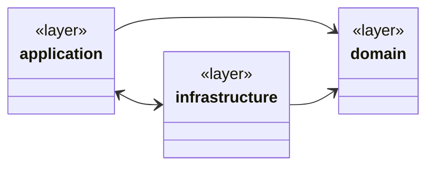

# Franquicia Core

**Franquicia Core** es un micro‑servicio **reactivo** que gestiona franquicias, sucursales, productos y stock. Su objetivo es ofrecer una API limpia y no bloqueante construida sobre Spring WebFlux y MongoDB.

---

## 🏗️ Tecnologías clave

| Capa         | Tecnologías                                                             |
| ------------ | ----------------------------------------------------------------------- |
| Lenguaje     | Java 17                                                                 |
| Framework    | Spring Boot 3.5 (Starter WebFlux, Actuator, Validation, Spring‑HATEOAS) |
| Persistencia | MongoDB 7 (Reactive Mongo)                                              |
| Build        | Gradle 8.14 (Wrapper)                                                   |
| Contenedores | Docker & Docker Compose                                                 |
| Log          | SLF4J / Logback                                                         |
| Utilidades   | Project Reactor, Lombok, Jakarta Validation                             |

---

## ⚙️ Arquitectura

```mermaid
flowchart TD
    UI([Cliente]) --HTTP--> GW[Spring WebFlux Controllers]
    GW --> APP[Application Layer (Use Cases)]
    APP --> DOMAIN[Domain Model]
    APP --> INFRA[Infrastructure]
    INFRA --> MONGO[(Reactive MongoDB)]
    subgraph Infra Details
      INFRA_REPOS[Reactive Repositories]
    end
```

* **Hexagonal / Clean Architecture**: la capa *application* orquesta casos de uso; la capa *domain* contiene modelos de negocio; la capa *infrastructure* provee controladores REST y adaptadores de persistencia.
* **Reactivo extremo**: todos los flujos son `Mono`/`Flux` para back‑pressure natural.

---

## 🚀 Despliegue rápido con Docker Compose

```bash
# 1. Clona el proyecto
$ git clone https://github.com/Coaxus-ux/FranquiciaCore-2
$ cd franquicia-core

# 2. Copia variables de entorno
$ cp env.example .env   # ajusta si lo necesitas

# 3. Levanta todo (MongoDB + API)
$ docker compose up -d  # o docker-compose en versiones antiguas

# 4. Comprueba salud
$ curl http://localhost:8080/franquiciacore/api/health | jq
```

> **Tips**
>
> * La API se expone en `http://localhost:8080/franquiciacore` (base‑path configurable).
> * Mongo Express se habilita con el *profile* `tools`: `docker compose --profile tools up`.

---

## 🖥️ Ejecución local sin Docker (dev)

```bash
# Requisitos: JDK 17, MongoDB local, Gradle 8.
$ ./gradlew bootRun  # arranca en 8080 por defecto
```

Para empaquetar:

```bash
$ ./gradlew clean build  # genera build/libs/*.jar
$ java -jar build/libs/franquiciacore.jar
```

---

## 📑 Variables de entorno principales

| Variable                   | Descripción                   | Valor por defecto |
| -------------------------- | ----------------------------- | ----------------- |
| `SPRING_WEBFLUX_BASE_PATH` | Base global de la API         | `/franquiciacore` |
| `APP_PORT`                 | Puerto del contenedor         | `8080`            |
| `MONGODB_*`                | Host, puerto, credenciales    | ver `.env`        |
| `SPRING_PROFILES_ACTIVE`   | Perfil Spring (`prod`, `dev`) | `prod`            |

---

## 🔗 Referencia de API

> Todas las rutas se anteponen con **`${SPRING_WEBFLUX_BASE_PATH}`** → `/franquiciacore`.

### Salud

| Método | Ruta          | Descripción           |
| ------ | ------------- | --------------------- |
| `GET`  | `/api/health` | Estado de la app y BD |

### Franquicias

| Método | Ruta                   | Cuerpo / Params              | Descripción                                 |
| ------ | ---------------------- | ---------------------------- | ------------------------------------------- |
| `POST` | `/api/franchises`      | `{ "name": "Franquicia X" }` | Crear franquicia                            |
| `GET`  | `/api/franchises/{id}` | –                            | Obtener franquicia                          |
| `PUT`  | `/api/franchises/{id}` | `{ "name": "Nuevo Nombre" }` | Actualizar nombre                           |
| `GET`  | `/api/franchises/all`  | –                            | Listar todas                                |
| `GET`  | `/api/franchises/top`  | –                            | Top product de cada sucursal por franquicia |

### Sucursales

| Método | Ruta                   | Cuerpo                                         | Descripción      |
| ------ | ---------------------- | ---------------------------------------------- | ---------------- |
| `POST` | `/api/subsidiary`      | `{ "franchiseId": "…", "name": "Sucursal A" }` | Crear sucursal   |
| `GET`  | `/api/subsidiary/{id}` | –                                              | Obtener sucursal |
| `PUT`  | `/api/subsidiary/{id}` | mismo cuerpo que POST                          | Actualizar       |
| `GET`  | `/api/subsidiary/all`  | –                                              | Listar           |

### Productos

| Método   | Ruta                                           | Cuerpo                                                  | Descripción                         |
| -------- | ---------------------------------------------- | ------------------------------------------------------- | ----------------------------------- |
| `POST`   | `/api/subsidiaries/{subsidiaryId}/products`    | `{ "name":"Prod 1", "category":"FOOD", "quantity":10 }` | Crear producto                      |
| `PUT`    | `/api/subsidiaries/{sid}/products/{pid}`       | `{ "name":"Nuevo Nombre" }`                             | Renombrar producto                  |
| `PUT`    | `/api/subsidiaries/{sid}/products/{pid}/stock` | `{ "quantity":5 }`                                      | Cambiar stock                       |
| `DELETE` | idem                                           | –                                                       | Eliminar producto                   |
| `GET`    | `/api/franchises/{fid}/products/max-stock`     | –                                                       | Producto con más stock por sucursal |

Todos los DTOs usan **Jakarta Validation**, devolviendo `400 Bad Request` con JSON

```json
{ "field": "mensaje de error" }
```

si los datos son inválidos (campos vacíos, negativos, etc.).

---

## 🧪 Pruebas

```bash
$ ./gradlew test
```

> Para pruebas de integración se recomienda arrancar un contenedor MongoDB (Testcontainers) o usar el `mongo` ya definido en Docker Compose con perfil `test`.

---

## 🖼️ Diagrama de paquetes (mermaid)



---

## 📜 Licencia

Proyecto de ejemplo interno. © 2025 Accenture. Todos los derechos reservados.
